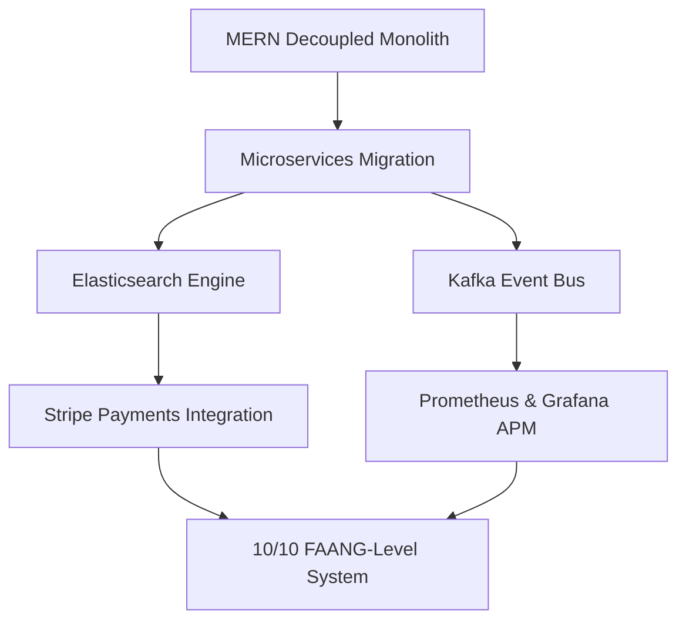

# AntiGravity Project Rating & Strategic Engineering Roadmap

This document evaluates the engineering complexity of the AntiGravity Airbnb Clone across different implementation stages and provides a clear technical roadmap to elevate the project to a **10/10 FAANG-level production architecture**.

---

## 1. Project Complexity Rating

We evaluate the project across three distinct lifecycle phases:

### Phase A: Monolithic EJS Codebase (Original State)
* **Rating:** **College / Basic Internship Level** (3/10)
* **Rationale:**
  - Tightly coupled monolithic architecture mixing backend routing with server-rendered EJS templates.
  - Stateful session-based cookies stored directly, limiting horizontal scaling.
  - Zero automated testing coverage.
  - Hardcoded server database configurations and lack of performance caching.

### Phase B: Decoupled MERN Codebase (Current State)
* **Rating:** **Product Company / High-Growth Startup Level** (8/10)
* **Rationale:**
  - Decoupled single page application (React client + Express REST API).
  - Stateless authentication using JWT access tokens and secure, HttpOnly, SameSite refresh tokens.
  - Robust security headers (Helmet), Mongo injection sanitizers, and request rate-limiters.
  - Dual-mode Redis and local in-memory fallback cache wrappers.
  - Business logic: Atomic date-overlap validations and weekend pricing multipliers.
  - DevOps: Multi-stage Docker containerization and Docker Compose configurations.
  - Automation: Automated Jest, Supertest, and mock component rendering checks.

---

## 2. Roadmap to Reach 10/10 (FAANG-Level Production)

To elevate this project to a 10/10 rating matching systems deployed by companies like Netflix, Airbnb, and Amazon, the following architecture upgrades must be implemented:

### 1. Re-Architecting to Microservices (NestJS / Go / gRPC)
* **Action:** Split the backend monolith into domain-specific microservices:
  - **Auth Service:** Node.js/JWT keys validation.
  - **Listings Service:** Go/MongoDB for low-latency searches.
  - **Booking Service:** NestJS/PostgreSQL (for ACID transactional guarantees on reservation schedules).
* **Communication:** Use **gRPC** for low-latency internal RPC calls and **Apache Kafka** or RabbitMQ as an event bus to handle asynchronous operations (e.g., sending verification emails, tracking analytics).
* **Orchestration:** Deploy services inside a **Kubernetes (EKS)** cluster to manage auto-scaling, ingress rules, and replica sets.

### 2. High-Fidelity Search Engine (Elasticsearch)
* **Action:** Replace MongoDB text indexing with **Elasticsearch** (or Algolia).
* **Benefits:** Implements autocomplete search queries, typo-tolerance fuzzy searches, multi-language translation, and spatial polygon bounds searches (e.g., "find listings inside this custom drawn area on the map"). Sync data from MongoDB to Elasticsearch using Logstash or Mongo Change Streams.

### 3. Distributed Caching (Redis Cluster)
* **Action:** Scale the single Redis instance to a **Redis Cluster** with read/write splitting.
* **Benefits:** Supports replication, automated failovers, and handles millions of cache requests without CPU bottlenecks.

### 4. Stripe Payments & Webhooks Integration
* **Action:** Integrate Stripe API checkout flows for reserving listings.
* **Verification:** Set up secure webhook handlers (`POST /api/webhooks/stripe`) verifying signatures to capture successful charge operations, update reservation records, and trigger automated host payouts.

### 5. Real-Time Messaging & Notifications (WebSockets)
* **Action:** Install Socket.io or WebSockets to support real-time chat between guest and host, live booking notifications, and live view counters ("5 users are looking at this home").

### 6. Log Aggregation & Observability (ELK Stack + Prometheus + Grafana)
* **Action:** Set up Prometheus to collect application metrics, Grafana for dashboard visualizations, and the ELK Stack (Elasticsearch, Logstash, Kibana) for log aggregation.
* **Benefits:** Crucial for monitoring system latency, CPU/memory consumption, and troubleshooting errors instantly across microservices.

### 7. End-to-End Visual Testing (Cypress / Playwright)
* **Action:** Set up Cypress or Playwright test suites.
* **Benefits:** Automates complete user workflows (login -> searching Goa -> selecting listing -> booking dates -> payment validation) on real headless browsers to ensure zero UI regression.
